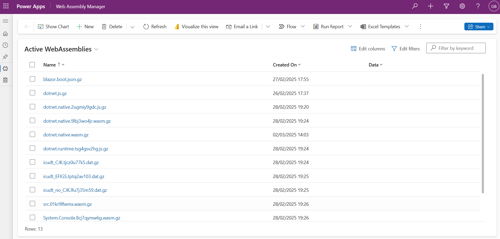
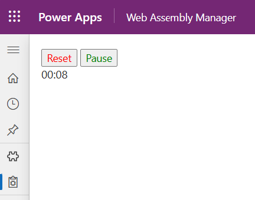

# Overview

This sample aimes to demonstrate how to load a .Net Web Assembly stopwatch sample inside a PCF Control using Web Resources

This sample was created using the following command

```pwsh
pac pcf init -n Stopwatch -ns WebAssembly -t field -npm
```

## Prerequisites

1. You have Power Platform Command Line Interface [installed](https://learn.microsoft.com/power-platform/developer/cli/introduction?tabs=windows). 

2. You have NodeJs [installed](https://nodejs.org/en/download/). 

## Getting Started

1. Change to stopwatch folder

```pwsh
cd Stopwatch
```

2. Install components

```pwsh
npm install
```

3. Run the sample

```pwsh
npm run start
```

## Package the solution

To package a version of the PCF control

1. Build the control

```pwsh
npm run build
```

2. Change to solution folder

```pwsh
cd stopwatch_pcf_control
```

3. Build the solution

```pwsh
cd stopwatch_pcf_control
```

4. Upload the create **stopwatch_pcf_control.zip** to your environment

## Power App Sample

The [DotNetWebAssembly_1_0_0_1.zip](./DotNetWebAssembly_1_0_0_1.zip) include a sample of using this PCF control inside a Power Platform solution. To use this sample

1. Import the solution to an environment

2. Publish all customizations

3. Run the **Web Assembly Manager** Model-Driven App

4. Create Dataverse records for the **\*.gz** files results of the **publish\wwwroot\_framework** folder of the [Stopwatch](../stopwatch/README.md) sample

  

5. Run the loaded application

  

## Options

The following options were evaluated to host the JavaScript and DotNet Web Assembly components

- Web Resources
- Dataverse Web Api

Datavesre Web Api was selected for this sample as it allows the ability to update the Web Assembly component at run time. It also had a more granular security model that can be applied using Security Roles.

### Web Resources

Web resources in Power Apps are virtual files stored in the Microsoft Dataverse database. They can be used to extend the functionality of model-driven apps or PCF controls by adding custom HTML, JavaScript, CSS, and other file types. Here are some key points to consider when working with web resources:

### Limitations of Web Resources

1. [**File Size Limitations**](https://learn.microsoft.com/power-apps/developer/model-driven-apps/web-resources#size-limitations): By default, the maximum size for a web resource file is 5MB. This limit can be increased if necessary by adjusting the system settings under the Email tab. For larger files, consider breaking them into smaller parts or using alternative storage solutions.

2. [**Supported File Types**](https://learn.microsoft.com/power-apps/developer/model-driven-apps/web-resources##web-resource-types): Power Apps web resources support a variety of file types, including HTML, JavaScript, CSS, XML, and image formats like PNG, JPG, and GIF. However, certain file types such as `.wasm`, `.wasm.gz`, `.dat`, `.wasm.br`, and `.dat.br` are not supported. Given dotnetwasm uses these file types, we will consider using alternative extensions or methods to include them in the project.

3. **Execution Context**: Web resources are limited to static files or files processed in the browser. They do not support server-side execution like ASP.NET (.aspx) pages. This means that any code within a web resource must be executed on the client side.

### Dataverse Web Api

The Dataverse Web API is a RESTful web service interface that allows you to interact with data stored in Microsoft Dataverse. Dataverse is a cloud-based storage solution that is part of the Microsoft Power Platform, which includes Power Apps, Power Automate, Power BI, and Power Virtual Agents. The Web API uses the OData (Open Data Protocol) version 4.0 standard, which is a protocol for building and consuming RESTful APIs over rich data sources.

With the Dataverse Web API, you can perform various operations such as creating, retrieving, updating, and deleting data. These operations can be performed both synchronously and asynchronously, making the API suitable for a wide range of applications. The Web API also supports querying data using OData query options, allowing you to filter, sort, and paginate results.

One of the key advantages of using the Dataverse Web API is its granular security model. The API respects the security roles and permissions defined in Dataverse, ensuring that only authorized users can access and modify data. This security model is applied using Security Roles, which can be configured to grant or restrict access to specific entities and operations.

In addition to the basic CRUD (Create, Read, Update, Delete) operations, the Dataverse Web API also supports more advanced features such as batch operations, metadata operations, and executing custom actions and functions. This makes it a powerful tool for building complex applications that require interaction with Dataverse data.

#### Extension Model with Model-Driven Applications

Model-driven applications in Power Apps provide a way to build sophisticated business applications with minimal code. These applications are built on top of Dataverse and leverage its data model, security, and business logic. One of the key features of model-driven applications is the ability to extend their functionality using the Power Apps Component Framework (PCF).

The Power Apps Component Framework allows developers to create custom components that can be embedded in model-driven applications. These components can interact with the Dataverse Web API to query and manipulate data. When a custom component makes a request to the Web API, it uses the security context of the logged-in user. This means that the component can only access data that the user has permission to view or modify, ensuring that the security model is maintained.

By using the Dataverse Web API and the Power Apps Component Framework, developers can create rich, interactive components that enhance the functionality of model-driven applications while respecting the security and data integrity of Dataverse. This combination provides a powerful platform for building enterprise-grade applications that can be customized to meet the specific needs of your organization.